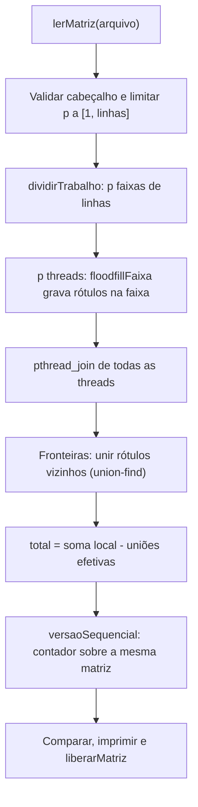
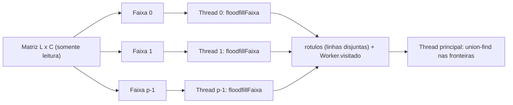
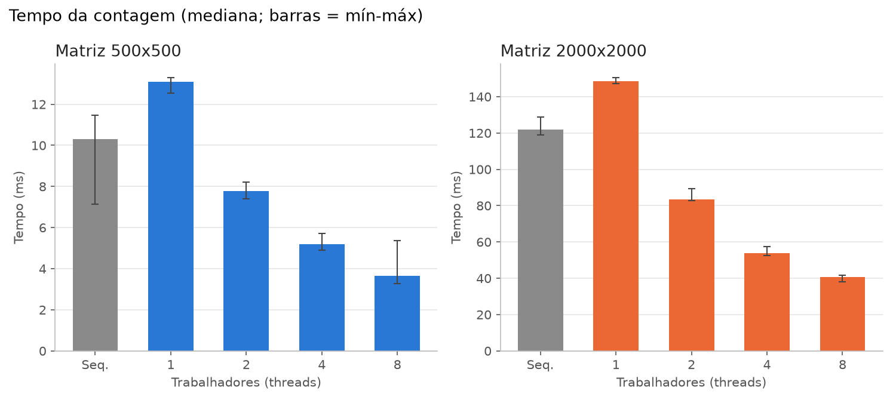
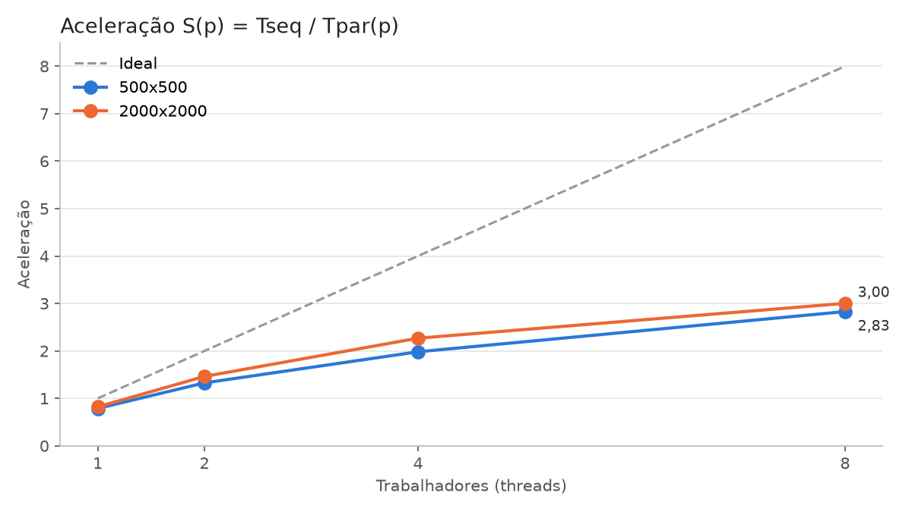
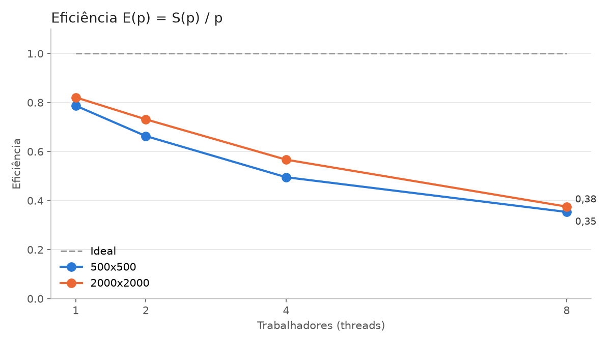

# Relatório técnico - Contagem paralela de objetos em uma matriz binária

> **Disciplina:** Sistemas Operacionais - 2026/II  
> **Professor:** Prof. Filipo Novo Mór  
> **Instituição:** Pontifícia Universidade Católica do Rio Grande do Sul - Escola Politécnica  
> **Repositório:** https://github.com/NullPointerKiller/sisop-t1
> **Versão do relatório:** 2.0  
> **Data:** 06/10/2026

## Identificação

| Campo | Informação |
|---|---|
| Integrante 1 | [Nathan Schmitt] |
| Matrícula do integrante 1 | [23111937] |
| Integrante 2 | [Jhone Salvador] |
| Matrícula do integrante 2 | [23111859] |
| Integrante 3 | [Isadora Santos] |
| Matrícula do integrante 3 | [23112526] |
| Modalidade | [Trio] |
| Turma | [330] |
| Estratégia paralela | Pthreads |
| Plataforma testada | [Linux]
| Commit avaliado | `a5a230d` |

## Resumo

O trabalho conta objetos em uma matriz binária, sendo um objeto um conjunto de células `1` ligadas por conectividade 8. A versão sequencial percorre a matriz e, a cada célula `1` ainda não visitada, incrementa o contador e executa um flood fill iterativo, com pilha explícita e uma matriz de visitados, sem alterar a entrada. A versão paralela, com Pthreads, divide a matriz em faixas contíguas de linhas, uma por thread. Cada thread rotula os objetos da sua faixa em uma matriz de rótulos compartilhada, escrevendo só nas próprias linhas, o que dispensa mutex. Após o `pthread_join`, a thread principal verifica as fronteiras entre faixas, incluindo as diagonais, e une rótulos equivalentes com union-find; o total é a soma das contagens locais menos as uniões efetivas. As cinco matrizes obrigatórias deram 3, 4, 5, 6 e 7 objetos nas duas versões, com 1, 2, 3, 4 e 8 threads, e 300 matrizes aleatórias não tiveram divergência. Em uma matriz 2000x2000, a aceleração foi de 2,27 com 4 threads e 3,00 com 8.

**Palavras-chave:** sistemas operacionais; paralelismo; processos; threads; conectividade 8; flood fill; componentes conexos.

## 1. Visão geral do problema

O programa recebe uma matriz binária na qual `0` representa o fundo e `1` representa o primeiro plano. Um objeto corresponde a um componente de células de valor `1` conectadas horizontalmente, verticalmente ou diagonalmente, conforme a **conectividade 8**.

O projeto contém duas implementações funcionalmente equivalentes:

1. uma versão sequencial, usada como referência de correção e de desempenho;
2. uma versão paralela baseada em Pthreads.

As duas ficam no mesmo executável (`contador`): o programa lê a matriz uma vez, roda a versão paralela, roda a sequencial sobre os mesmos dados, imprime resultado e tempo de cada uma e termina com código 2 se os resultados forem diferentes.

### 1.1 Objetivos da implementação

- Contar corretamente os objetos com conectividade 8.
- Distribuir trabalho efetivo entre pelo menos duas unidades de execução.
- Reconhecer e unificar objetos que atravessam as divisões da matriz.
- Produzir resultados determinísticos e idênticos nas versões sequencial e paralela.
- Evitar condições de corrida, deadlocks, atualizações perdidas e contagens duplicadas.
- Avaliar correção, sobrecarga, escalabilidade, aceleração e eficiência.

### 1.2 Requisitos atendidos

| Requisito | Como foi atendido | Evidência no repositório |
|---|---|---|
| ANSI C C89/C90 | Declarações no início dos blocos, comentários `/* */`, sem VLA; compila com `-std=c89 -pedantic` sem avisos | [`Makefile`](Makefile) (`CFLAGS`), seção 10.2 |
| Conectividade 8 | Vetores `dLinha`/`dColuna` com os 8 deslocamentos; na fronteira são verificadas as colunas `j-1`, `j` e `j+1` | [`floodfill.c`](floodfill.c) linhas 8-9, [`workers.c`](workers.c) linhas 119-134 |
| Versão sequencial | `contador` + `floodfill` iterativo com matriz `visitado` | [`floodfill.c`](floodfill.c) linhas 14 e 53, [`main.c`](main.c) `versaoSequencial` linha 90 |
| Versão paralela | `dividirTrabalho` cria uma thread por faixa (`trabalhar`) e consolida as fronteiras | [`workers.c`](workers.c) linhas 34 e 142 |
| Duas ou mais unidades concorrentes | Uma thread por faixa; testado com 1, 2, 3, 4 e 8 threads (e até 64 nos testes aleatórios) | `make test` |
| Quantidade configurável de trabalhadores | Segundo argumento (`./contador arquivo p`) ou `make run WORKERS=p`; limitado a `[1, linhas]` | [`main.c`](main.c) linhas 31-48 |
| Consolidação entre regiões | Union-find (`encontrar`/`unir`) sobre os rótulos das duas linhas de cada fronteira | [`workers.c`](workers.c) linhas 7-24 e 104-138 |
| Tratamento horizontal, vertical e diagonal | Fronteiras horizontais entre faixas; verticais e diagonais pelas colunas `j-1..j+1` | Exemplos 2, 3 e 5; casos A2 e A3 (seção 8) |
| Verificação das chamadas POSIX | `pthread_create`, `pthread_join`, `malloc`/`calloc` e `fopen` verificados | [`workers.c`](workers.c) linhas 78 e 90, seção 10.1 |
| Liberação dos recursos | Toda thread criada é aguardada (também em caso de erro); matrizes, pilhas e union-find liberados | [`workers.c`](workers.c) linhas 87-101, [`matriz.c`](matriz.c) linha 66 |
| Compilação reproduzível | `make`, `make run`, `make test`, `make bench`, `make clean` | [`Makefile`](Makefile) |

## 2. Organização do repositório

```text
.
├── README.md
├── RELATORIO_TECNICO.md
├── Makefile
├── main.c                  programa principal (argumentos, cronômetro, saída)
├── matriz.c / matriz.h     leitura e liberação da matriz
├── floodfill.c / .h        flood fill sequencial e flood fill por faixa
├── workers.c / workers.h   threads, divisão em faixas e union-find
├── genMatriz.py            gerador de matrizes aleatórias
├── matriz 500x500.txt
├── tests/
│   ├── obrigatorios/       exemplos 1 a 5 do enunciado
│   ├── adicionais/         casos de borda criados pelo grupo
│   ├── rodar_testes.sh     make test
│   └── medir.sh            make bench
├── results/
│   ├── medicoes.csv
│   ├── graficos.py
│   ├── grafico-tempo.png
│   ├── grafico-aceleracao.png
│   └── grafico-eficiencia.png
└── slides/
    └── apresentacao.pdf
```

| Caminho | Finalidade |
|---|---|
| `main.c` | Implementação principal: lê argumentos, roda as duas versões e mede o tempo. |
| `floodfill.c` | Implementação sequencial de referência (`contador`, `floodfill`) e flood fill por faixa. |
| `workers.c` | Implementação paralela (`dividirTrabalho`, `trabalhar`, union-find). |
| `tests/obrigatorios/` | Cinco matrizes obrigatórias do enunciado. |
| `tests/adicionais/` | Casos adicionais criados pelo grupo. |
| `tests/grande_2000x2000.txt` | Matriz grande do desempenho; gerada pelo `make bench` com semente fixa (fora do git por ter 8 MB). |
| `results/medicoes.csv` | Dados brutos das medições de desempenho. |
| `results/*.png` | Gráficos gerados por `results/graficos.py` a partir do CSV. |
| `slides/apresentacao.pdf` | Slides utilizados na apresentação. |

A estrutura sugerida no enunciado (`src/conta-objetos-sequencial.c` e `src/conta-objetos-paralelo.c`) não foi adotada: o código já estava separado por responsabilidade (leitura, flood fill, threads e programa principal) e as duas versões ficam no mesmo executável para serem comparadas sobre os mesmos dados.

## 3. Ambiente de desenvolvimento e execução

### 3.1 Hardware e software

| Item | Especificação |
|---|---|
| Processador | AMD Ryzen 7 7735HS |
| Núcleos físicos | 8 |
| Processadores lógicos | 16 |
| Memória RAM | 16 GB DDR5 (15,4 GB utilizáveis) |
| Sistema operacional | Linux Mint 22.3 |
| Arquitetura | x86_64 |
| Compilador | GCC 13.3.0 |
| Padrão da linguagem | C89/C90 |
| APIs POSIX utilizadas | `pthread_create`, `pthread_join`, `clock_gettime(CLOCK_MONOTONIC)` |
| Flags de compilação | `-std=c89 -Wall -Wextra -pedantic -O2 -pthread` |


### 3.2 Compilação

```bash
make clean
make
```

Sem `make`:

```bash
cc -std=c89 -Wall -Wextra -pedantic -O2 -pthread -o contador main.c matriz.c floodfill.c workers.c
```

### 3.3 Execução

```bash
./contador [ARQUIVO] [NUMERO_DE_THREADS]
```

Sem argumentos, usa `matriz 500x500.txt` e 4 threads.

**Exemplo reproduzível:**

```bash
./contador tests/obrigatorios/exemplo3_8x8.txt 2
make test
```

### 3.4 Formato da entrada e da saída

A primeira linha do arquivo é `LINHASxCOLUNAS`, seguida dos valores `0`/`1` separados por espaço. Cabeçalho inválido gera `erro: cabecalho invalido` e código de saída 1; valores faltando são considerados `0`. O número de threads é o segundo argumento, limitado a `[1, linhas]`.

Entrada (`tests/obrigatorios/exemplo1_5x5.txt`):

```text
5x5
1 1 0 0 0
1 1 0 0 0
0 0 0 1 0
0 0 0 1 0
1 0 0 0 0
```

Saída de `./contador tests/obrigatorios/exemplo1_5x5.txt 2`:

```text
worker trabalhando de 0 a 3
worker trabalhando de 3 a 5
Numero de objetos (paralelo, 2 threads): 3 (0.006155 s)
Numero de objetos (sequencial): 3 (0.000005 s)
```

Cada thread imprime a sua faixa (a ordem dessas linhas pode variar). Os tempos são só da contagem, sem a leitura do arquivo.

## 4. Arquitetura da solução

### 4.1 Fluxo geral



### 4.2 Estruturas de dados principais

| Estrutura | Tipo/representação | Responsabilidade | Compartilhada? | Proteção utilizada |
|---|---|---|---|---|
| Matriz de entrada | `Matriz` com `int **dados` (L x C) | Armazenar `0` e `1` | Sim | Somente leitura durante a contagem |
| Células visitadas/rótulos | Sequencial: `char **visitado`. Paralela: `int **rotulos` (0 = não visitado) | Distinguir células processadas | `rotulos`: sim | Cada thread só escreve nas linhas da sua faixa |
| Fila/pilha do flood fill | Vetor `int *pilha` com posições linearizadas | Percorrer um componente sem recursão | Não | Uma pilha por thread, do tamanho da faixa |
| Tarefas/regiões | `Worker { matriz, rotulos, inicio, final, visitado, erro }` | Distribuir trabalho | Não (um por thread) | Preenchido pela principal antes do `pthread_create` |
| Equivalências de rótulos | Vetor `int *pai` (L·C + 1) | Consolidar componentes | Não | Usado só pela principal após o `pthread_join` |
| Resultados locais | `Worker.visitado` e `Worker.erro` | Contagem local e falha de alocação | Não | Escritos só pela thread dona; lidos após o join |

## 5. Implementação sequencial

### 5.1 Algoritmo

`contador` ([`floodfill.c`](floodfill.c) linha 53) aloca a matriz `visitado` (zerada) e uma pilha de L·C posições. Percorre a matriz linha a linha; a cada célula `1` não visitada, incrementa o contador e chama `floodfill`. `floodfill` marca a célula semente, empilha sua posição (`linha * colunas + coluna`) e, enquanto a pilha não estiver vazia, desempilha uma posição e testa os 8 vizinhos dados por `dLinha`/`dColuna`: esquerda, diagonal esquerda baixo, baixo, diagonal direita baixo, direita, diagonal direita cima, cima e diagonal esquerda cima. Cada vizinho dentro da matriz, com valor `1` e ainda não visitado, é marcado e empilhado. A matriz de entrada não é alterada.

### 5.2 Pseudocódigo

```text
FUNÇÃO contar_objetos_sequencial(M):
    vis <- matriz L x C zerada ; pilha <- vetor de L·C posições
    cont <- 0
    PARA cada (i, j):
        SE M[i][j] == 1 E NÃO vis[i][j]:
            cont <- cont + 1
            vis[i][j] <- 1 ; empilha(i, j)
            ENQUANTO pilha não vazia:
                (r, c) <- desempilha()
                PARA cada (dr, dc) em {-1, 0, 1}² exceto (0, 0):
                    SE (r+dr, c+dc) dentro da matriz E M == 1 E NÃO vis:
                        vis <- 1 ; empilha(r+dr, c+dc)
    RETORNE cont
```

### 5.3 Complexidade e uso de memória

| Aspecto | Análise | Justificativa |
|---|---|---|
| Complexidade de tempo | O(L·C) | Cada célula é empilhada no máximo uma vez e cada desempilhamento testa 8 vizinhos. |
| Complexidade de espaço | O(L·C) | Matriz `visitado` (1 byte por célula) e pilha de no máximo L·C inteiros. |
| Risco de recursão excessiva | Não existe | O flood fill é iterativo. A versão recursiva anterior estourava a pilha da thread na matriz 800x800 com 1 thread; a troca resolveu (seção 11). |

## 6. Implementação paralela

### 6.1 Modelo de concorrência

| Decisão | Escolha do grupo | Justificativa |
|---|---|---|
| Unidade de execução | Thread (Pthreads) | Memória compartilhada: as threads leem a mesma matriz sem cópia nem IPC. |
| Quantidade de trabalhadores | `./contador arquivo p` (ou `make run WORKERS=p`), limitada a `[1, linhas]` | Variar `p` nos testes sem recompilar. |
| Divisão do trabalho | Faixas contíguas de linhas | Fronteiras só horizontais, consolidação simples. |
| Escalonamento | Estático | Uma faixa por thread, definida antes da criação. |
| Comunicação | Estruturas compartilhadas (`Matriz`, `rotulos`, `Worker`) | Cada thread escreve só nas suas linhas de `rotulos` e no seu `Worker`. |
| Sincronização | Apenas `pthread_join` | Não há escrita concorrente na mesma posição, logo não há mutex. |

### 6.2 Decomposição da matriz

`base = L / p` e `resto = L % p` ([`workers.c`](workers.c) linha 63); as `resto` primeiras faixas recebem `base + 1` linhas e as demais `base`. Exemplo: L = 10, p = 4 resulta em 3, 3, 2, 2. Como `p` é limitado a `L`, nenhuma faixa fica vazia; `p < 1` vira 1. Cada `Worker` recebe `inicio` (inclusivo) e `final` (exclusivo).



### 6.3 Paralelismo efetivo

O trecho paralelo é a rotulação local: cada thread varre as linhas da sua faixa e executa `floodfillFaixa`, que é o trabalho dominante, O(L·C / p) por thread. As threads trabalham ao mesmo tempo sobre partes disjuntas da matriz, então há cálculo real em paralelo, não só concorrência aparente. O balanceamento é feito pelo número de linhas; com densidade uniforme (como na matriz do `genMatriz.py`), as faixas têm carga parecida.

| Etapa | Sequencial ou paralela? | Unidade responsável | Motivo |
|---|---|---|---|
| Leitura/geração da matriz | Sequencial (fora do tempo medido) | Thread principal | E/S de arquivo, feita uma vez. |
| Particionamento | Sequencial, O(p) | Thread principal | Custo desprezível. |
| Identificação local | **Paralela**, O(L·C / p) | Threads trabalhadoras | Parte dominante do custo. |
| Análise das fronteiras | Sequencial, O(p·C) | Thread principal | Poucas linhas; evita locks. |
| Consolidação | Sequencial; alocação de `rotulos` e inicialização de `pai`, O(L·C) | Thread principal | Simplicidade; ver seção 9.8. |
| Contagem final | Sequencial, O(p) | Thread principal | Soma das contagens locais menos as uniões. |

### 6.4 Sincronização, comunicação e regiões críticas

| Recurso/dado | Risco concorrente | Mecanismo usado | Escopo da proteção | Justificativa |
|---|---|---|---|---|
| `matriz->dados` | Nenhum | Somente leitura | Toda a execução | Nenhuma thread escreve na entrada. |
| `rotulos` | Condição de corrida | Partição disjunta por linhas | `floodfillFaixa` não sai de `[inicio, final)` | Nenhuma célula é escrita por duas threads. |
| `Worker[t]` | Atualização perdida | Uma estrutura por thread + `pthread_join` | Toda a execução da thread | A principal só lê `visitado` e `erro` depois do join. |
| `pai` (union-find) | Condição de corrida | Uso exclusivo da thread principal | Após todos os `pthread_join` | O join funciona como barreira. |

Não há mutex nem outro bloqueio, então não pode haver deadlock: a única espera é o `pthread_join` da thread principal sobre threads que não esperam por nada. Se um `pthread_create` falhar, as threads já criadas ainda são aguardadas antes de liberar a memória que elas usam.

## 7. Consolidação dos componentes

Somar as contagens locais não basta: um objeto que atravessa a fronteira entre duas faixas é contado uma vez em cada faixa.

### 7.1 Identificação local

Ao encontrar um novo objeto na célula `(i, j)`, a thread incrementa `visitado` e usa o rótulo `i·C + j + 1`, a posição da célula semente mais 1 ([`workers.c`](workers.c) linha 165). Cada célula é semente de no máximo um objeto, então o rótulo é único na matriz inteira, sem combinar com outras threads e sem limite por faixa. Como é sempre ≥ 1, nunca se confunde com o `0` de "não visitado".

### 7.2 Verificação das fronteiras

| Situação | Pares de células verificados | Como a equivalência é registrada |
|---|---|---|
| Fronteira horizontal | Para cada coluna `j` da última linha `r` da faixa: `(r, j)` com `(r+1, j)` | `unir(pai, rótulo A, rótulo B)` |
| Fronteira vertical | Não existe na divisão por linhas: cada faixa ocupa todas as colunas | - |
| Conexão diagonal | `(r, j)` com `(r+1, j-1)` e `(r+1, j+1)` | `unir(pai, rótulo A, rótulo B)` |
| Encontro de quatro blocos | Não ocorre na divisão por linhas. Situação equivalente: um objeto que cruza várias faixas, inclusive pela diagonal (diagonal longa do Exemplo 5 com 3 threads), é unido por transitividade | Uniões encadeadas no union-find |

### 7.3 Unificação e contagem global

Depois de todos os `pthread_join`, a thread principal cria o vetor `pai` (L·C + 1 posições, `pai[x] = x`) e percorre cada fronteira. `encontrar` usa *path halving* (`pai[x] = pai[pai[x]]`); `unir` liga uma raiz à outra e retorna 1 só quando as raízes eram diferentes. Cada união efetiva junta dois componentes locais em um, então `total = soma de visitado - número de uniões efetivas`. Não há sincronização nesta etapa porque só a thread principal executa.

### 7.4 Exemplo rastreável

Exemplo 3 (8x8) com p = 2: faixa 0 = linhas 0-3 e faixa 1 = linhas 4-7.

```text
linha 0: 1 1 0 0 0 0 0 0
linha 1: 1 0 0 0 0 0 0 0
linha 2: 0 0 0 0 0 0 1 0
linha 3: 0 0 0 1 1 0 1 0   <- última linha da faixa 0
-------------------------
linha 4: 0 0 0 1 1 0 0 0   <- primeira linha da faixa 1
linha 5: 0 0 0 0 0 0 0 0
linha 6: 0 0 1 0 0 0 0 1
linha 7: 0 0 1 0 0 0 1 1
```

| Região | Rótulo local | Células de fronteira relevantes | Equivalência global |
|---|---|---|---|
| Faixa 0, semente (0,0) | 0·8 + 0 + 1 = 1 | - | Objeto A |
| Faixa 0, semente (2,6) | 2·8 + 6 + 1 = 23 | (3,6): abaixo só há 0 | Objeto B |
| Faixa 0, semente (3,3) | 3·8 + 3 + 1 = 28 | (3,3) e (3,4) | Objeto C |
| Faixa 1, semente (4,3) | 4·8 + 3 + 1 = 36 | (4,3) e (4,4) | `unir(28, 36)`: Objeto C |
| Faixa 1, semente (6,2) | 6·8 + 2 + 1 = 51 | - | Objeto D |
| Faixa 1, semente (6,7) | 6·8 + 7 + 1 = 56 | - | Objeto E |

Contagens locais 3 + 3 = 6; uma união efetiva (`unir(28, 36)`; os outros pares da fronteira já estão na mesma raiz); total 6 - 1 = **5**, igual à versão sequencial.

## 8. Correção e testes funcionais

### 8.1 Procedimento de validação

`make test` ([`tests/rodar_testes.sh`](tests/rodar_testes.sh)) roda cada matriz de `tests/` com 1, 2, 3, 4 e 8 threads e marca APROVADO só se o resultado paralelo e o sequencial forem iguais ao esperado. Além disso, o próprio `contador` compara as duas versões em toda execução e sai com código 2 se divergirem. Um script externo gerou 300 matrizes aleatórias (1 a 80 linhas/colunas, densidade aleatória, semente 2026) e rodou cada uma com 1 a 64 threads.

### 8.2 Matrizes obrigatórias

| Exemplo | Dimensões | Objetos esperados | Resultado sequencial | Resultado paralelo | Trabalhadores | Situação | Evidência |
|---:|---:|---:|---:|---:|---:|---|---|
| 1 | 5 x 5 | 3 | 3 | 3 | 1, 2, 3, 4, 8 | Aprovado | [`exemplo1_5x5.txt`](tests/obrigatorios/exemplo1_5x5.txt), `make test` |
| 2 | 6 x 8 | 4 | 4 | 4 | 1, 2, 3, 4, 8 | Aprovado | [`exemplo2_6x8.txt`](tests/obrigatorios/exemplo2_6x8.txt), `make test` |
| 3 | 8 x 8 | 5 | 5 | 5 | 1, 2, 3, 4, 8 | Aprovado | [`exemplo3_8x8.txt`](tests/obrigatorios/exemplo3_8x8.txt), `make test` |
| 4 | 9 x 12 | 6 | 6 | 6 | 1, 2, 3, 4, 8 | Aprovado | [`exemplo4_9x12.txt`](tests/obrigatorios/exemplo4_9x12.txt), `make test` |
| 5 | 12 x 12 | 7 | 7 | 7 | 1, 2, 3, 4, 8 | Aprovado | [`exemplo5_12x12.txt`](tests/obrigatorios/exemplo5_12x12.txt), `make test` |

### 8.3 Casos de teste adicionais

| ID | Dimensões | Característica avaliada | Resultado de referência | Configurações paralelas | Resultado obtido | Situação |
|---|---:|---|---:|---|---:|---|
| A1 | 10 x 10 | Matriz somente com zeros | 0 | 1, 2, 3, 4, 8 | 0 | Aprovado |
| A2 | 10 x 10 | Um único objeto (coluna) ocupando todas as faixas | 1 | 1, 2, 3, 4, 8 | 1 | Aprovado |
| A3 | 10 x 10 | Conexões somente diagonais (diagonal principal) | 1 | 1, 2, 3, 4, 8 | 1 | Aprovado |
| A4 | 2000 x 2000 | Matriz grande usada no desempenho | 13345 (sequencial) | 1, 2, 4, 8 (5 repetições) | 13345 | Aprovado |
| A5 | 1 x 30 | Uma única linha (p limitado a 1) | 10 | 1, 2, 3, 4, 8 | 10 | Aprovado |
| A6 | 10 x 10 | Matriz toda com 1 (um objeto em todas as faixas) | 1 | 1, 2, 3, 4, 8 | 1 | Aprovado |
| A7 | 500 x 500 | Matriz do repositório (`matriz 500x500.txt`) | 911 | 1, 2, 4, 8 (5 repetições) | 911 | Aprovado |
| A8 | 1 a 80 | 300 matrizes aleatórias | Sequencial | 1 a 64 threads | 0 divergências | Aprovado |

### 8.4 Repetibilidade e determinismo

| Teste | Repetições | Configurações | Resultados idênticos? | Observações |
|---|---:|---|---|---|
| `matriz 500x500.txt` | 5 por configuração | 1, 2, 4, 8 threads | Sim | 911 em todas as 20 execuções |
| `tests/grande_2000x2000.txt` | 5 por configuração | 1, 2, 4, 8 threads | Sim | 13345 em todas as 20 execuções |

O resultado não depende da ordem de execução das threads: cada faixa é rotulada sempre da mesma forma, os rótulos dependem só da posição da semente e a consolidação é sequencial.

## 9. Avaliação de desempenho

### 9.1 Metodologia experimental

| Parâmetro | Valor adotado |
|---|---|
| Matriz ou conjunto de matrizes | `tests/grande_2000x2000.txt` (gerada por `genMatriz.py 2000 2000 ... 2026`, ~50% de 1s, 13345 objetos) e `matriz 500x500.txt` (911 objetos) |
| Mesmos dados em todas as versões? | Sim: as duas versões contam a mesma matriz em memória, lida uma vez |
| Relógio/API de medição | `clock_gettime(CLOCK_MONOTONIC, ...)` |
| Trecho medido | Paralela: `dividirTrabalho` inteiro (alocação, threads, rotulação e consolidação). Sequencial: `contador` inteiro. Leitura do arquivo excluída. |
| Aquecimentos descartados | Nenhum |
| Repetições por configuração | 5 para a paralela. A sequencial é medida em toda execução: 20 medições por matriz. |
| Medida representativa | Mediana |
| Critério para dispersão | Mínimo-máximo |
| Carga do sistema durante os testes | Notebook em uso normal (sem isolamento de carga) [CONFERIR com quem rodou o `make bench`] |
| Flags de otimização | `-O2` |

As medições brutas estão em [`results/medicoes.csv`](results/medicoes.csv) e são geradas por `make bench` ([`tests/medir.sh`](tests/medir.sh)).

### 9.2 Métricas

A aceleração para `p` trabalhadores é calculada por:

$$
S(p) = \frac{T_{sequencial}}{T_{paralelo}(p)}
$$

A eficiência paralela é calculada por:

$$
E(p) = \frac{S(p)}{p}
$$

### 9.3 Resultados consolidados

**Matriz 2000x2000 (13345 objetos)**

| Versão | Trabalhadores (`p`) | Tempo representativo (ms) | Dispersão (ms) | Aceleração `S(p)` | Eficiência `E(p)` | Resultado correto? |
|---|---:|---:|---:|---:|---:|---|
| Sequencial | 1 | 121,83 | 118,81 - 128,86 | 1,00 | 1,00 | Sim |
| Paralela | 1 | 148,39 | 147,17 - 150,54 | 0,82 | 0,82 | Sim |
| Paralela | 2 | 83,29 | 82,85 - 89,24 | 1,46 | 0,73 | Sim |
| Paralela | 4 | 53,72 | 52,45 - 57,57 | 2,27 | 0,57 | Sim |
| Paralela | 8 | 40,57 | 38,17 - 41,76 | 3,00 | 0,38 | Sim |

**Matriz 500x500 (911 objetos)**

| Versão | Trabalhadores (`p`) | Tempo representativo (ms) | Dispersão (ms) | Aceleração `S(p)` | Eficiência `E(p)` | Resultado correto? |
|---|---:|---:|---:|---:|---:|---|
| Sequencial | 1 | 10,30 | 7,13 - 11,46 | 1,00 | 1,00 | Sim |
| Paralela | 1 | 13,09 | 12,53 - 13,30 | 0,79 | 0,79 | Sim |
| Paralela | 2 | 7,77 | 7,40 - 8,21 | 1,33 | 0,66 | Sim |
| Paralela | 4 | 5,20 | 4,90 - 5,72 | 1,98 | 0,50 | Sim |
| Paralela | 8 | 3,64 | 3,29 - 5,38 | 2,83 | 0,35 | Sim |

### 9.4 Dados brutos das repetições

| Versão | Trabalhadores | Repetição 1 (ms) | Repetição 2 (ms) | Repetição 3 (ms) | Repetição 4 (ms) | Repetição 5 (ms) | Medida representativa (ms) |
|---|---:|---:|---:|---:|---:|---:|---:|
| Sequencial 2000x2000 | 1 | 20 medições no CSV | | | | | 121,83 |
| Paralela 2000x2000 | 1 | 148,39 | 147,72 | 147,17 | 150,54 | 149,05 | 148,39 |
| Paralela 2000x2000 | 2 | 89,24 | 83,29 | 83,63 | 82,85 | 83,04 | 83,29 |
| Paralela 2000x2000 | 4 | 52,45 | 53,97 | 53,72 | 52,90 | 57,57 | 53,72 |
| Paralela 2000x2000 | 8 | 41,76 | 40,57 | 39,71 | 40,95 | 38,17 | 40,57 |
| Sequencial 500x500 | 1 | 20 medições no CSV | | | | | 10,30 |
| Paralela 500x500 | 1 | 13,09 | 12,66 | 12,53 | 13,30 | 13,15 | 13,09 |
| Paralela 500x500 | 2 | 7,77 | 7,60 | 8,21 | 8,04 | 7,40 | 7,77 |
| Paralela 500x500 | 4 | 5,20 | 5,31 | 4,90 | 5,72 | 4,92 | 5,20 |
| Paralela 500x500 | 8 | 3,64 | 5,38 | 3,51 | 3,79 | 3,29 | 3,64 |

### 9.5 Gráfico de tempo de execução



**Figura 1 -** Tempo de execução da versão sequencial e das configurações paralelas, um painel por matriz. Barras de erro representam o mínimo e o máximo das repetições. Fonte: elaborado pelo grupo.

### 9.6 Gráfico de aceleração



**Figura 2 -** Aceleração observada em função da quantidade de trabalhadores. A linha ideal corresponde a `S(p) = p`. Fonte: elaborado pelo grupo.

### 9.7 Gráfico de eficiência



**Figura 3 -** Eficiência paralela em função da quantidade de trabalhadores. Fonte: elaborado pelo grupo.

### 9.8 Análise dos resultados

- **Ganho em relação à sequencial:** na 2000x2000 a paralela é 1,46x mais rápida com 2 threads, 2,27x com 4 e 3,00x com 8. Na 500x500 o ganho é parecido (2,83 com 8 threads), mas em valores absolutos são só alguns milissegundos.
- **Efeito da quantidade de threads:** a aceleração cresce com o número de threads, mas bem abaixo do ideal: de 4 para 8 threads passa de 2,27 para 3,00, embora a máquina tenha 8 núcleos físicos. O limite vem da parte sequencial (abaixo), não da falta de núcleos.
- **Por que `S(1) < 1`:** com 1 thread a paralela faz o mesmo flood fill da sequencial, mas ainda cria a thread, aloca a matriz de rótulos (`int`, 4 bytes por célula, contra 1 byte do `visitado`) e inicializa o vetor `pai` de L·C posições. Essa sobrecarga deixa a paralela 22% mais lenta na 2000x2000 e 27% na 500x500.
- **Comunicação, sincronização e contenção:** não há locks; a única sincronização é o `pthread_join`. Não há contenção de escrita porque as faixas são disjuntas.
- **Granularidade e balanceamento:** a matriz tem densidade uniforme, então faixas do mesmo tamanho têm carga parecida. A divisão estática perderia eficiência em matrizes com densidade irregular.
- **Custo da consolidação:** as uniões nas fronteiras custam O(p·C), pouco. O que pesa é a parte sequencial O(L·C): alocar e zerar `rotulos` e inicializar `pai`. Pela lei de Amdahl, isso limita a aceleração máxima, e a eficiência cai de 0,73 (p = 2) para 0,38 (p = 8) na 2000x2000.
- **Memória e cache:** a matriz é um vetor de linhas alocadas separadamente (`int **`) e o flood fill acessa posições vizinhas de forma irregular, o que limita o ganho por thread.
- **Trechos que permanecem sequenciais:** particionamento, alocação de `rotulos`, inicialização do union-find, uniões nas fronteiras e contagem final.

## 10. Tratamento de erros e qualidade do código

### 10.1 Chamadas e recursos POSIX

| Chamada/recurso | Erro verificado? | Ação em caso de falha | Liberação/finalização |
|---|---|---|---|
| `pthread_create` | Sim | Mensagem, para de criar threads e marca erro; as já criadas são aguardadas; `dividirTrabalho` retorna -1 | `pthread_join` |
| `pthread_join` | Sim | Mensagem e marca erro; `dividirTrabalho` retorna -1 | - |
| `fork` | Não se aplica | - | - |
| Mutex/semáforo | Não se aplica | - | - |
| `fopen` / `fscanf` | Sim | Mensagem; matriz vazia; `main` termina com código 1 | `fclose` |
| `malloc` / `calloc` | Sim (todos) | Mensagem, libera o que já foi alocado e retorna -1 (ou matriz vazia em `lerMatriz`); falha na pilha da thread é sinalizada em `Worker.erro` | `free` em `liberarMatriz`, `liberarVisitado`, `liberarRotulos` e ao fim de cada função |

### 10.2 Compilação e análise

| Verificação | Comando/ferramenta | Resultado |
|---|---|---|
| Compilação C89/C90 | `cc -std=c89 -Wall -Wextra -pedantic -pthread` (via `GCC` x86_64-linux-gnu`) | Sem erros e sem avisos |
| Avisos do compilador | `-Wall -Wextra -pedantic` | Nenhum aviso |
| Vazamentos de memória | Não realizado |
| Condições de corrida | Análise do acesso (seção 6.4) e 300 matrizes aleatórias com 1 a 64 threads comparadas com a sequencial | Nenhuma divergência; ThreadSanitizer não executado |

### 10.3 Separação de responsabilidades

Entrada em `matriz.c`; processamento sequencial e flood fill por faixa em `floodfill.c`; criação das threads, divisão do trabalho, sincronização (join) e consolidação em `workers.c`; argumentos, medição e saída em `main.c`; testes e medições em `tests/` (`rodar_testes.sh`, `medir.sh`); gráficos em `results/graficos.py`.

## 11. Limitações e decisões de projeto

| Limitação ou decisão | Impacto | Alternativa considerada | Motivo da escolha |
|---|---|---|---|
| Flood fill iterativo com pilha explícita | Memória extra de até L·C inteiros (sequencial) ou do tamanho da faixa (por thread) | Recursão (versão anterior) | A recursão estourava a pilha da thread na 800x800 com 1 thread. |
| Matriz de rótulos separada (`int **`) | 4 bytes por célula e alocação sequencial O(L·C) | Gravar o rótulo na própria matriz (versão anterior) | A entrada fica intacta, e sequencial e paralela usam os mesmos dados sem reler o arquivo. |
| Faixas estáticas de linhas | Desbalanceamento com densidade irregular; não há "encontro de quatro blocos" | Blocos 2D ou fila dinâmica | Consolidação mais simples (só fronteiras horizontais). |
| Consolidação só na thread principal | Parte sequencial limita a aceleração (Amdahl) | Consolidação paralela por pares de faixas | Evita sincronização na união. |
| Um executável com as duas versões | As versões não podem ser executadas isoladamente | `src/conta-objetos-sequencial.c` e `src/conta-objetos-paralelo.c` | Compara as duas sobre os mesmos dados em toda execução. |
| `printf` dentro de cada thread | Saída intercalada; pequeno custo no trecho medido | Remover ou imprimir só em depuração | Mostra a divisão em faixas na demonstração. |

## 12. Conclusão

Os objetivos foram alcançados. As duas versões contam corretamente os objetos com conectividade 8: as cinco matrizes obrigatórias deram 3, 4, 5, 6 e 7 nas duas versões com 1, 2, 3, 4 e 8 threads, e não houve divergência em 300 matrizes aleatórias com até 64 threads. Objetos que atravessam faixas, inclusive pela diagonal, são unificados por union-find sem contagem duplicada. A divisão em faixas disjuntas dispensa mutex, o que elimina condições de corrida e deadlocks. O código segue C89 e compila sem avisos com as flags do enunciado.

No desempenho, o paralelismo compensa a partir de matrizes grandes: na 2000x2000, a aceleração foi de 1,46 com 2 threads, 2,27 com 4 e 3,00 com 8. O ganho fica bem abaixo do ideal porque a alocação da matriz de rótulos e a consolidação continuam sequenciais (lei de Amdahl), e em matrizes pequenas a criação das threads pesa tanto quanto o trabalho paralelo.

O principal aprendizado foi que dividir o trabalho é a parte fácil, e o difícil é juntar os resultados: sem a consolidação nas fronteiras a soma local fica errada. Também ficou claro que a recursão, aceitável em matrizes pequenas, não serve para uma thread com pilha limitada. Uma melhoria futura realista é paralelizar a alocação dos rótulos e a consolidação, que hoje limitam a aceleração.

## 13. Vídeo de apresentação

| Campo | Informação |
|---|---|
| Plataforma | [YouTube] |
| Link privado ou não listado | [https://youtu.be/ubhQiJ_sbMk?is=Cgz_QTOHBpmfTBxY] |
| Duração | [08:22] |
| Privacidade | [Não listado] |
| Senha, se aplicável | [`Não se aplica`] |
| Data da última verificação do acesso | [06/10/2026] |

### 13.1 Conteúdo do vídeo

- [x] Problema e estratégia escolhida.
- [x] Implementação sequencial e referência de correção.
- [x] Decomposição, processos/threads e sincronização.
- [x] Consolidação de objetos que atravessam regiões.
- [x] Demonstração executável.
- [x] Testes obrigatórios e adicionais.
- [x] Resultados de desempenho.
- [x] Conclusões.
- [x] Participação de ambos os integrantes, quando o trabalho for em dupla.

## 14. Contribuições dos integrantes

| Atividade | Integrante 1 | Integrante 2 | Evidência/observação |
|---|---|---|---|
| Projeto da solução sequencial | [Nathan Schmitt] | [Isadora Santos] | Commits `a19e8ba`, `41699d6`, `a5a230d` |
| Projeto da solução paralela | [Nathan Schmitt] | [Jhone Salvador] | Commits `f519ce6`, `e05df56`, `a5a230d` |
| Sincronização/comunicação | [Nathan Schmitt] | [Jhone Salvador] | Commits `e05df56`, `a5a230d` |
| Consolidação | [Nathan Schmitt] | [Jhone Salvador] | Commits `e05df56`, `a5a230d` |
| Testes e medições | [Nathan Schmitt] | [] | `genMatriz.py` (`d625c69`), `tests/` e `results/` (`a5a230d`) |
| Documentação e apresentação | [Isadora Santos] | [Nathan Schmitt] | `README.md`, `RELATORIO_TECNICO.md`, `slides/` |

Todos os integrantes declaram compreender integralmente o código, as estruturas de dados, a divisão do trabalho, a sincronização, a comunicação, a consolidação e os resultados apresentados.

## 15. Ferramentas, bibliotecas, referências e códigos externos

| Recurso | Finalidade | Origem/link | Licença, quando aplicável | Partes do projeto afetadas |
|---|---|---|---|---|
| POSIX Threads (Pthreads) | Criação e espera das threads | Biblioteca do sistema | - | `workers.c` |
| Python 3 + `random` | Geração de matrizes de teste | https://www.python.org | PSF | `genMatriz.py` |
| matplotlib | Gráficos de desempenho | https://matplotlib.org | Licença matplotlib (BSD) | `results/graficos.py`, `results/*.png` |
| Zig (`zig cc`) 0.16 | Compilação C89 no Windows e compilação cruzada para Linux/macOS | https://ziglang.org | MIT | Seções 3, 8, 9 e 10 |
| Claude Code (Anthropic) | Revisão do código, adaptação para C89, flood fill iterativo, tratamento de erros, scripts de teste e medição, gráficos e revisão deste relatório e dos slides | https://claude.com/claude-code | - | `*.c`, `*.h`, `Makefile`, `tests/`, `results/`, `README.md`, este relatório. Resultados conferidos executando o programa. |

## 16. Checklist de entrega

### Código e execução

- [x] O código segue ANSI C C89/C90.
- [x] O projeto compila em Linux ou macOS.
- [x] A compilação ocorre sem erros e os avisos foram tratados ou justificados.
- [x] As principais chamadas POSIX têm os retornos verificados.
- [x] Todos os recursos são finalizados ou liberados corretamente.
- [x] A versão sequencial conta componentes com conectividade 8.
- [x] A versão paralela distribui cálculo real entre pelo menos duas unidades.
- [x] A quantidade de processos/threads é configurável.
- [x] Conexões horizontais, verticais e diagonais são preservadas.
- [x] Componentes que atravessam regiões são consolidados sem duplicidade.
- [x] Não há condições de corrida, deadlocks ou atualizações perdidas conhecidas.

### Testes e desempenho

- [x] As cinco matrizes obrigatórias foram executadas nas duas versões.
- [x] A versão paralela produziu exatamente os mesmos resultados da sequencial.
- [x] Foi criada pelo menos uma matriz maior para o teste de desempenho.
- [x] Foram testadas pelo menos duas quantidades de processos/threads.
- [x] As medições foram repetidas e o valor representativo foi explicado.
- [x] Tempo sequencial, tempo paralelo, aceleração e eficiência foram informados.
- [x] Resultados em que a versão paralela foi mais lenta foram explicados.
- [x] Dados brutos, tabelas e gráficos estão versionados no repositório.

### Repositório e apresentação

- [x] O repositório do GitHub está público.
- [x] `README.md` contém descrição, autoria, compilação, execução e arquitetura.
- [x] O `Makefile` ou as instruções equivalentes permitem compilação reproduzível.
- [x] As matrizes de teste e seus resultados estão incluídos.
- [x] A análise de desempenho está incluída.
- [x] Os slides estão em `slides/apresentacao.pdf`.
- [x] O link do vídeo está acessível e o vídeo tem até 10 minutos.
- [x] Ferramentas, referências, bibliotecas e códigos externos foram identificados.
- [x] O hash do commit avaliado foi registrado neste relatório.

## Apêndice A - Registro de comandos

```bash
# Informações do ambiente (Linux)
lscpu | grep -E "Model name|^CPU\(s\)|Core\(s\)"
gcc --version

# Compilação
make clean && make

# Execução dos testes obrigatórios e adicionais
sh tests/rodar_testes.sh ./contador        # = make test

# Execução dos testes de desempenho
sh tests/medir.sh ./contador               # = make bench
python3 results/graficos.py
```

## Apêndice B - Formato dos dados brutos

O arquivo `results/medicoes.csv` usa o cabeçalho abaixo. Cada execução do `contador` gera uma linha `paralela` e uma `sequencial`; na linha sequencial, `repeticao` vale `p-r` (execução `r` da configuração com `p` threads).

```csv
matriz,linhas,colunas,versao,trabalhadores,repeticao,tempo_ms,objetos,resultado_correto
tests/grande_2000x2000.txt,2000,2000,sequencial,1,1-1,120.296,13345,true
tests/grande_2000x2000.txt,2000,2000,paralela,1,1,148.389,13345,true
```

## Apêndice C - Correspondência com os critérios de avaliação

| Critério | Peso | Seções com evidências |
|---|---:|---|
| Correção sequencial e paralela, incluindo conectividade 8 | 2,0 | 5, 6, 7 e 8 |
| Decomposição do problema e paralelismo efetivo | 1,5 | 6.1, 6.2 e 6.3 |
| Sincronização, comunicação e ausência de condições de corrida | 1,5 | 6.4 e 10 |
| Consolidação de objetos que atravessam regiões | 1,5 | 7 |
| Testes obrigatórios, adicionais e análise de desempenho | 1,0 | 8 e 9 |
| Qualidade do código ANSI C e tratamento de erros | 1,0 | 3 e 10 |
| Organização do repositório e documentação | 0,5 | 2, 3 e 16 |
| Apresentação, demonstração e domínio da implementação | 1,0 | 13 e 14 |
